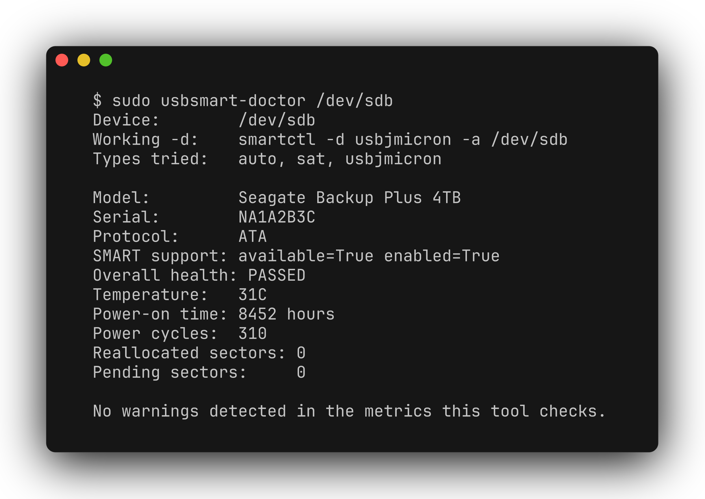

# usbsmart-doctor

[](README.md) [](README.zh-CN.md)

Find a usable `smartctl` device type for a USB-connected drive, then summarize its SMART health data. This Linux CLI tries USB bridge types when automatic detection fails and can remember a working type for later checks.



## Requirements and installation

Requires Linux, Python 3.9+, and `smartmontools` (`smartctl` on PATH). SMART access often requires elevated privileges. Python runtime code uses the standard library only.

```bash
# Debian/Ubuntu; use your distro's package manager elsewhere
sudo apt install smartmontools
git clone https://github.com/zhuhroscar-tech/usbsmart-doctor.git
cd usbsmart-doctor
python3 -m venv .venv
source .venv/bin/activate
pip install -e .
usbsmart-doctor --help
```

A standalone `.pyz` is also available from [GitHub Releases](https://github.com/zhuhroscar-tech/usbsmart-doctor/releases). Check the release's available assets before downloading; a source install does not depend on PyPI publication.

## Usage

Replace `/dev/sdb` with the correct drive. Do not guess the device path.

```bash
usbsmart-doctor /dev/sdb
usbsmart-doctor /dev/sdb --json
usbsmart-doctor /dev/sdb --type sat
usbsmart-doctor /dev/sdb --no-cache
```

If device permissions require root, use the installed executable explicitly, for example `sudo .venv/bin/usbsmart-doctor /dev/sdb` from the repository directory.

The report includes available temperature, sector, wear, and self-assessment information. `--type` bypasses the normal candidate list; `--no-cache` disables cache reads and writes.

| Exit code | Meaning |
| --- | --- |
| `0` | No checked warning reported; not a guarantee of drive health |
| `1` | No working device type found |
| `2` | `smartctl` missing |
| `3` | SMART overall self-assessment failed |
| `4` | Other warnings reported |

## Safety and privacy

The tool issues read commands only: it does not write to the drive or launch self-tests. It makes no network requests. Unsupported bridges and missing SMART fields can still prevent a useful diagnosis; keep backups regardless of the report.

The optional cache is `~/.cache/usbsmart-doctor/known_bridges.json`, keyed by USB identity when available. Reports can include drive serial numbers; redact them before sharing. Delete the cache to forget learned types.

## Development

```bash
pip install -e ".[dev]"
pytest -v
```

Tests exercise parsing and mocked probes; passing tests do not establish compatibility with every physical enclosure. [MIT license](LICENSE).
